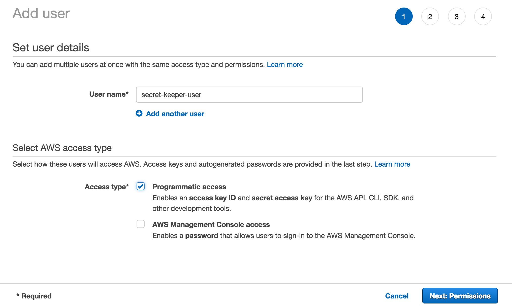
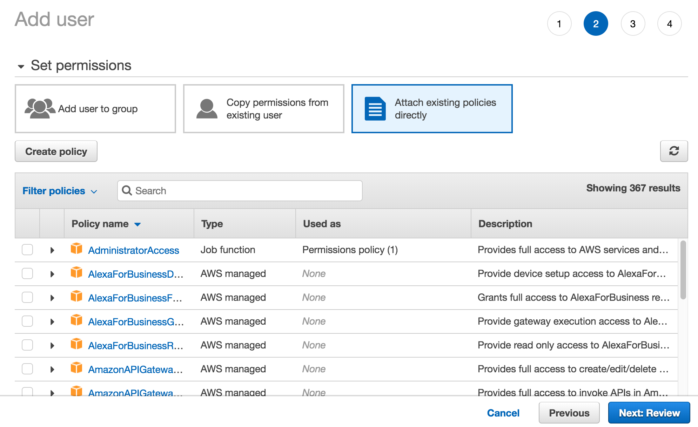
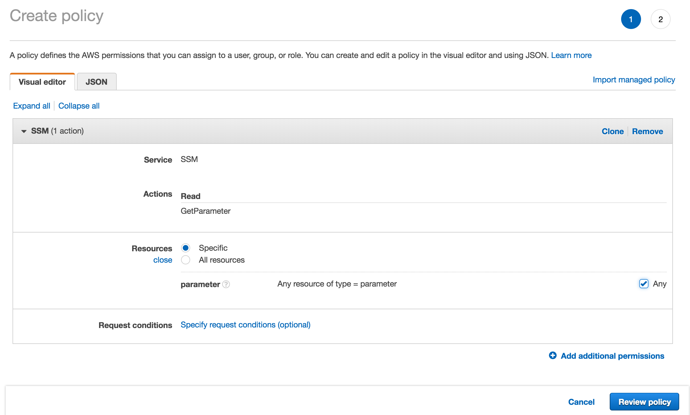
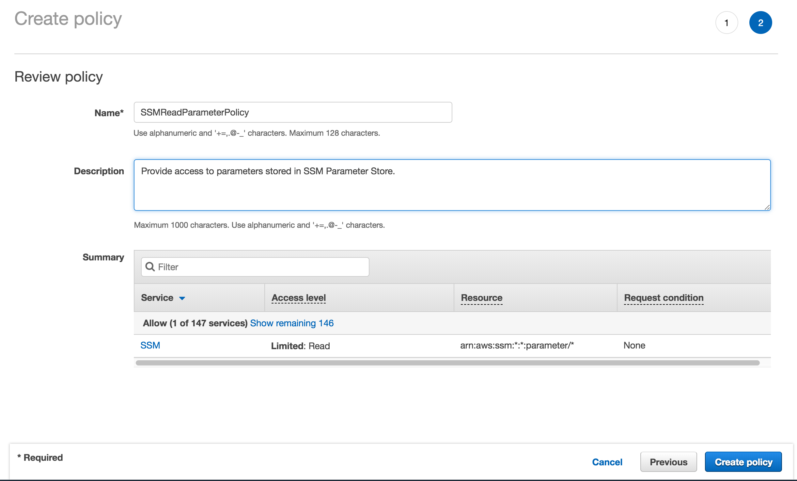
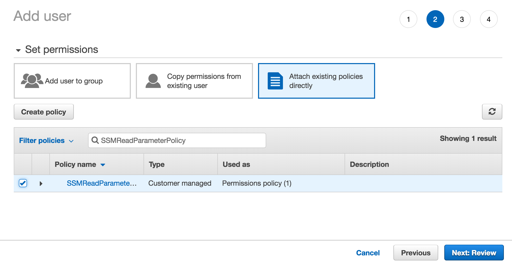
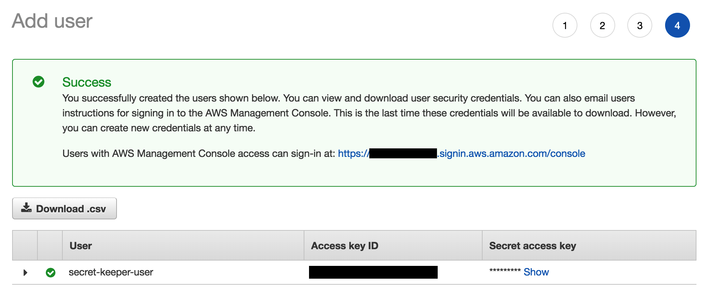
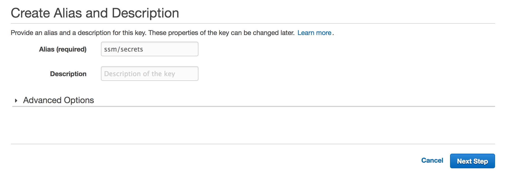
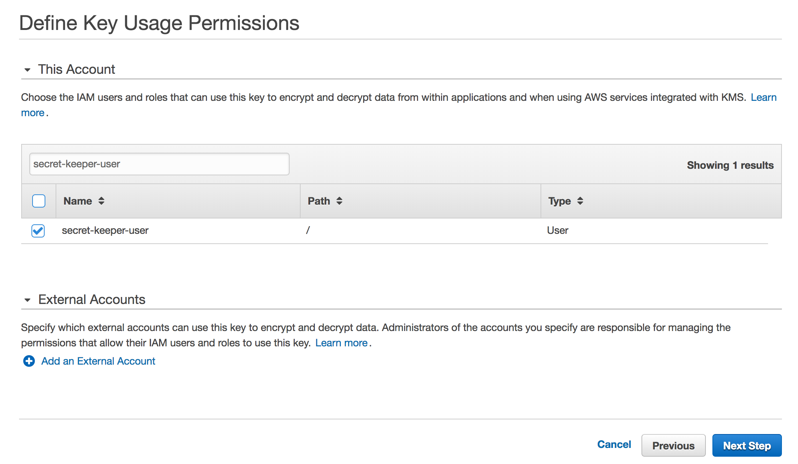
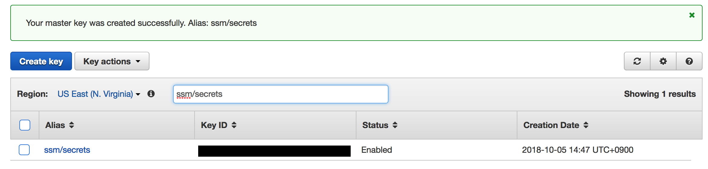
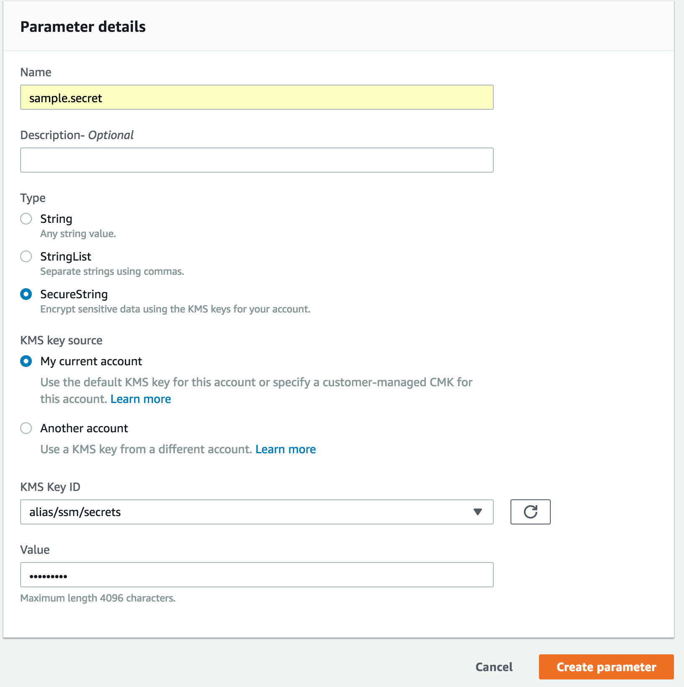

# Secret Keeper - Python

[](https://travis-ci.com/ridi/secret-keeper-python)

## Introduction
Without secret-keeper, you would have:
- hard-coded your secrets in your version-controlled source code (Worst!), or
- created a not-version-controlled config file and manually provide it when you deploy your code, or
- let your deployment system - Jenkins CI, etc - mananage your not-version-controlled config file, but you have as many of them as your projects.

With secret-keeper, you can:
- store your secrets in AWS and let your applications use it safely and conveniently.
- let AWS manage contents of your secrets, keeping them encoded and safe.
- version-control usage of secrets inside your applications, since secrets are referred only with their aliases.
- simply provide access key and secret key of your dedicated IAM user to your deployment system. You don't have to manage per-project config files.


## Preparation
- Create a dedicated AWS IAM user.
  - From AWS console, go to IAM > Users.
  - Click 'Add User'.
  - Enter your yourname (`seecret-keeper-user` in this example). From access type, check only on "Programmatic access". Click "Next: Permissions".
  
  - Click "Attach existing policies directly" and click "Create policy"
  
    - From "Service", find "SSM" and select it.
    - From "Actions", browse to "Read" > "GetParameter" and check on it.
    - From "Resources", check on "parameter".
    
    - Click "Review policy".
  - Name your policy as `SSMReadParameterPolicy` and write descriptions. Click "Create policy".
  
  - Go back to "Set permissions" page. Find the `SSMReadParameterPolicy` policy that you just created, and check on it. Click "Next: Review"
  
  - Review your choices and click "Create user".
  - You will be shown the new user's access key ID and secret access key. **Don't forget to write down the secret key. You will never see it again.**
  
- Create a dedicated encryption key in AWS KMS.
  - From AWS console, go to IAM > Encryption Keys.
  - Select your region and click "Create key".
  - From "Step 1", enter alias for your encryption key (`ssm/secrets` in this example) and click "Next step".
  
  - Skip and click "Next step" for "Step 2: Add Tags" and "Step 3: Define Key Administrative Permissions".
  - From "Step 4: Define Key Usage Permissions", find the dedicated user that you created above (`secret-keeper-user` in this example) and check on it. Click "Next step".
  
  - Review your key policy and click "Finish".
  - Confirm that a encryption key is created in your region.
  

## Usage
- Create a sample secret with AWS SSM Parameter Store.
  - From AWS console, go to Systems Manager > Parameter Store. Make sure you have selected the right region in which you created the encryption key.
  - Click "Create Parameter".
  - Enter Parameter details:
    - Name: `sample.secret`
    - Type: SecureString
    - KMS key source: My current account
    - KMS Key ID: Alias of the dedicated encryption key you created above, like `alias/ssm/secrets`. Or the key ID, like `11223344-5566-7788-9900-aabbccddeeff`.
    - Value: `pa$$w@rd!`
  
- Write sample application.
```Python
# sample.py
if __name__ == "__main__":
    from ridi import secret_keeper

    secret = secret_keeper.tell("sample.secret")
    print("Secret: %s" % secret)
```

- Run the sample application. You must provide the dedicated user's access key and secret key, and the region as environment variables.
```bash
$ export SECRETKEEPER_AWS_ACCESS_KEY="YOUR_ACCESS_KEY_ID"
$ export SECRETKEEPER_AWS_SECRET_KEY="YOUR_SECRET_ACCESS_KEY"
$ export SECRETKEEPER_AWS_REGION="us-east-1"
$ python sample.py
Secret: pa$$w@rd!
```
